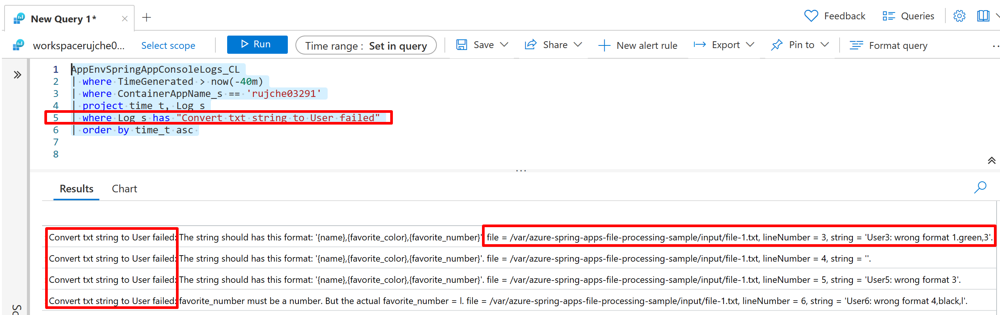
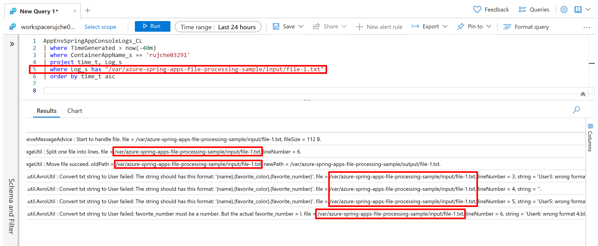

# Azure Spring Apps File Processing Sample

## Requirements

1. [100%] The app reads TXT files from a specific folder and converts them to [Avro](https://avro.apache.org/docs/1.11.1/) format and then pushes it to [Azure Event Hubs](https://learn.microsoft.com/en-us/azure/event-hubs/event-hubs-about). After file handled, move the file to another folder to avoid duplicate handling.
2. [100%] When the app run in [Azure Spring Apps](https://learn.microsoft.com/en-us/azure/spring-apps/overview), the specific folder is an [Azure Storage File Share](https://learn.microsoft.com/en-us/azure/storage/files/storage-files-introduction) mounted in Azure Spring Apps.
3. [50%] The app is not a long-running process, it runs at configurable intervals (For example: Run every 6 hours).
    - [0%] The app can run then exit after all files processed.
    - [0%] The interval can be configured.
4. [50%] Unknown text files count, so the app or running environment must take care of the scaling
   - [100%] The app can handle all files, not need to know the file count before app starts.
   - [0%] Auto scaling.
5. [60%] Operation friendly: Auto recovery from error, for example:
   - [100%] An invalid text format. Handled by: Output a warning log.
   - [100%] Easy troubleshooting. For example: Get all logs about a specific file.
   - [50%] Event Hub is unreachable. Handled by: Exit system when send message to EventHub failed.
   - [0%] Too many data to process in one interval. Not handled. Current idea: Handle it by admin instance and worker instance.
6. [100%] This is a classic [Enterprise Integration Pattern](http://www.eaipatterns.com/), so we use the [Spring Boot](https://spring.io/projects/spring-boot) + [Spring Integration](https://spring.io/projects/spring-integration) in this application.

## Scenario 1: Run on Azure Spring Apps Consumption plan

### Provision required Azure resources
1. Provision an Azure Spring Apps Standard consumption plan. Refs: [Provision an Azure Spring Apps Standard consumption plan service instance](https://learn.microsoft.com/en-us/azure/spring-apps/quickstart-provision-standard-consumption-service-instance?tabs=Azure-portal).
2. Create an Azure Event Hub. Refs: [Create an event hub using Azure portal](https://learn.microsoft.com/en-us/azure/event-hubs/event-hubs-create).
3. Create Azure Storage. Refs: [How to enable your own persistent storage in Azure Spring Apps with the Standard consumption plan](https://learn.microsoft.com/en-us/azure/spring-apps/how-to-custom-persistent-storage-with-standard-consumption).

### Deploy current sample.
1. Build package.
   ```shell
   ./mvnw clean package
   ```
2. Deploy app
   ```shell
   az spring app deploy \
     --resource-group $RESOURCE_GROUP \
     --service $AZURE_SPRING_APPS_INSTANCE \
     --name $APP_NAME \
     --artifact-path target/azure-spring-apps-file-processing-sample-0.0.1-SNAPSHOT.jar
   ```
3. Check log by [Azure CLI](https://learn.microsoft.com/en-us/cli/azure/)
   ```shell
   az spring app logs \
     --resource-group $RESOURCE_GROUP \
     --service $AZURE_SPRING_APPS_INSTANCE \
     --name $APP_NAME
   ```
4. Check logs by [Azure Portal](https://ms.portal.azure.com/) -> Monitoring -> Logs
 
   Query:
   ```
   AppEnvSpringAppConsoleLogs_CL
   | where TimeGenerated > now(-7m)
   | where ContainerAppName_s == 'rujche03291'
   | project time_t, Log_s
   | order by time_t asc
   ```

   Screenshot:
   

## Scenario 2: Operation friendly

1. When a line of text is invalid. Handled by: Output a warning log.

   Query:
   ```
   AppEnvSpringAppConsoleLogs_CL
   | where TimeGenerated > now(-40m)
   | where ContainerAppName_s == 'rujche03291'
   | project time_t, Log_s
   | where Log_s has "Convert txt string to User failed"
   | order by time_t asc
   ```

   Screenshot:
   

2. Easy troubleshooting. For example: Get all logs about a specific file.

   Query:
   ```
   AppEnvSpringAppConsoleLogs_CL
   | where TimeGenerated > now(-40m)
   | where ContainerAppName_s == 'rujche03291'
   | project time_t, Log_s
   | where Log_s has "/var/azure-spring-apps-file-processing-sample/input/file-1.txt"
   | order by time_t asc
   ```

   Screenshot:
   

## Scenario 3: Store secret in Azure Key Vault

TODO: For example: store file passwords / connection-string in Azure Key Vault.

## Scenario 4: Auto Scaling.

Not finished yet. Need to consider how to split the tasks into each app instance. Let each app instance handle a sub set of all files.

