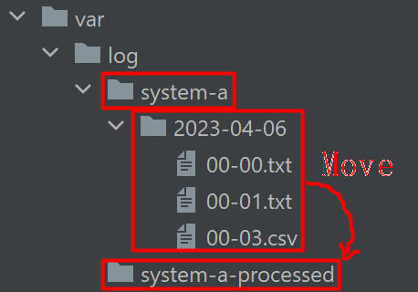
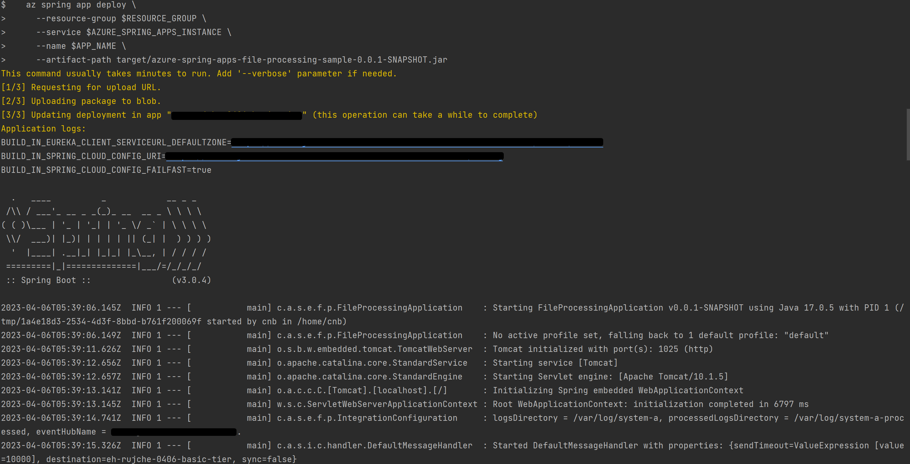
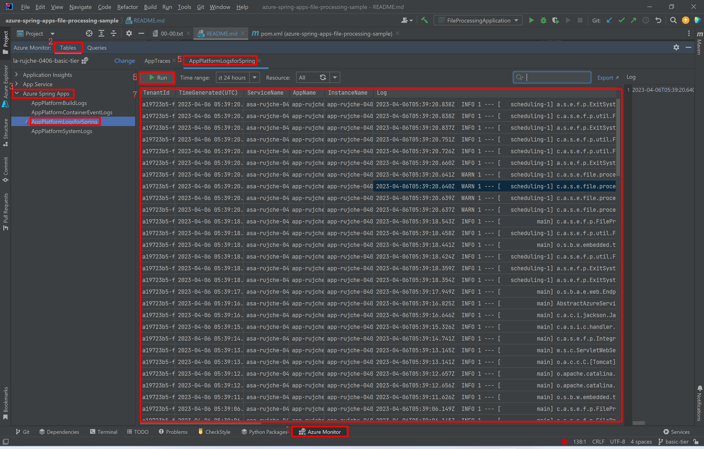
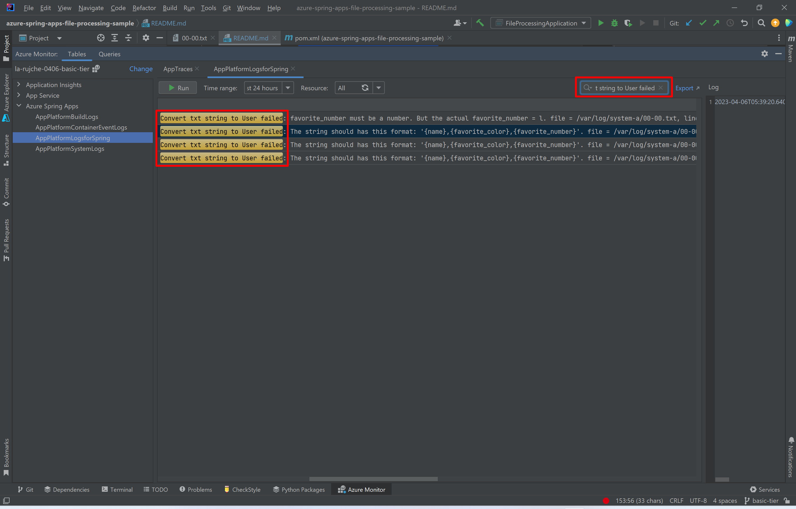
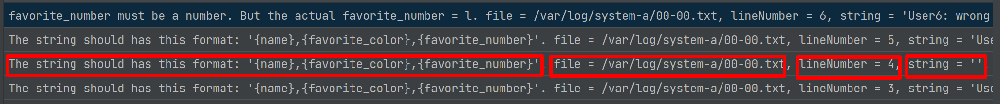
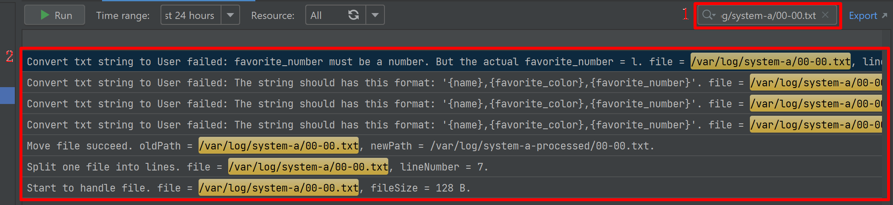
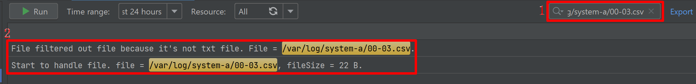
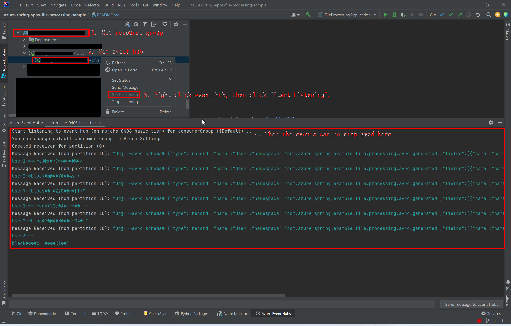

# Azure Spring Apps File Processing Sample

## 1. Scenario

### 1.1. Log Files Explanation

1. A system generates log files in folders named by date: `/var/log/system-a/${yyyy-MM-dd}`. 
2. The log files are txt files named by hour and minute: `${hh-mm}.txt`.
3. Each line of the log files will have format like this: `${name,favorite_color,favorite_number}`.

   Here is a picture about folder structure and log file:

   

### 1.2. File Processing Requirements

#### 1.2.1. Functional Requirements
1. Before app starts, the number of files to be processed in unknown.
   - All files in specific folder should be processed.
   - All files in sub folder should be processed, too.
2. Each line should be converted into an [avro](https://avro.apache.org/docs/1.11.1/) object. Here is the format of avro:
   ```json
   {
     "namespace": "com.azure.spring.example.file.processing.avro.generated",
     "type": "record",
     "name": "User",
     "fields": [
       {
         "name": "name",
         "type": "string"
       },
       {
         "name": "favorite_number",
         "type": [
           "int",
           "null"
         ]
       },
       {
         "name": "favorite_color",
         "type": [
           "string",
           "null"
         ]
       }
     ]
   }
   ```
3. Send the avro object to [Azure Event Hubs](https://learn.microsoft.com/en-us/azure/event-hubs/event-hubs-about).
4. After file processed, move the file to another folder to avoid duplicate processing. Here is an example of move target folder: `/var/log/system-a-processed/${yyyy-MM-dd}`

   Here is a picture about moving log files after processed:

   

#### 1.2.2. Non-Functional Requirements

1. The system must be robust. 
   - 1.1. Handle invalid file. Current application only handle txt files. For other file types like csv, it will be filtered out.

     

    - 1.2. Handle invalid line. When there is a invalid data line in a file, output a warning log then continue processing.

     

2. Easy to track.
   - 2.1. When there is invalid line, the log should contain these information:
      - Which file?
      - Which line?
      - Why this line is invalid?
      - What is the string value of this line?
   - 2.2. Track each step of a specific file.
      - Does this file be added in to processing candidate?
      - If the file is filtered out, why it's filtered out?
      - How many line does this file have?
      - Does each line of this file been converted to avro object and send to Azure Event Hubs successfully?


### 1.3. System Diagram

   

1. **Azure Spring Apps**: Current application will run on Azure Spring Apps.
2. **Azure Storage Files**: Log files stored in Azure Storage files.
3. **Azure Event Hubs**: In log files, each valid line will be converted into avro format then send to Azure Event Hubs. 
4. **Log Analytics**: When current application run in Azure Spring Apps, the logs can be viewed by Log Analytics.

### 1.4. The Application
The scenario is a classic [Enterprise Integration Pattern](https://www.enterpriseintegrationpatterns.com/index.html), so we use the [Spring Boot](https://spring.io/projects/spring-boot) + [Spring Integration](https://spring.io/projects/spring-integration) in this application.

## 2. Run Current Sample on Azure Spring Apps Consumption Plan

### 2.1. Provision Required Azure Resources

1. Provision an Azure Spring Apps instance. Refs: [Quickstart: Provision an Azure Spring Apps service instance](https://learn.microsoft.com/en-us/azure/spring-apps/quickstart-provision-service-instance?tabs=Azure-portal&pivots=programming-language-java).
2. Create An app in created Azure Spring Apps.
3. Create an Azure Event Hub. Refs: [Create an event hub using Azure portal](https://learn.microsoft.com/en-us/azure/event-hubs/event-hubs-create).
4. Create Azure Storage Account. Refs: [Create a storage account](https://learn.microsoft.com/en-us/azure/storage/common/storage-account-create?tabs=azure-portal).
5. Create a File Share in created Storage account.
6. Mount Azure Storage into Azure Spring Apps to `/var/log/`. Refs: [How to enable your own persistent storage in Azure Spring Apps](https://learn.microsoft.com/en-us/azure/spring-apps/how-to-custom-persistent-storage?tabs=Azure-portal).

### 2.2. Deploy Current Sample

1. Set these environment variables for the app.
   ```properties
   logs-directory=/var/log/system-a
   processed-logs-directory=/var/log/system-a-processed
   spring.cloud.azure.eventhubs.connection-string=
   spring.cloud.azure.eventhubs.event-hub-name=
   ```

2. Upload some sample log files into Azure Storage Files. You can use files in [./test-files/var/log/system-a](./test-files/var/log/system-a).

3. Build package.
   ```shell
   ./mvnw clean package
   ```

4. Set necessary environment variables according to the created resources.
   ```shell
   RESOURCE_GROUP=
   AZURE_SPRING_APPS_INSTANCE=
   APP_NAME=
   ```

5. Deploy app
   ```shell
   az spring app deploy \
     --resource-group $RESOURCE_GROUP \
     --service $AZURE_SPRING_APPS_INSTANCE \
     --name $APP_NAME \
     --artifact-path target/azure-spring-apps-file-processing-sample-0.0.1-SNAPSHOT.jar
   ```

   After deployed successfully, you can see logs like this: 
   

### 2.3. Check Details About File Processing

1. Check logs by [Azure Toolkit for IntelliJ](https://github.com/microsoft/azure-tools-for-java/blob/develop/PluginsAndFeatures/azure-toolkit-for-intellij/azure-intellij-plugin-lib/src/main/resources/whatsnew.md#added-2).

   Screenshot:
   

2. Get log of specific error.

   Input `Convert txt string to User failed` in search box:
   
   Error details can be found in the log:
   

3. Get all logs about a specific file.

   Input `/var/log/system-a/00-00.txt` in search box:
   

   Input `/var/log/system-a/00-03.csv` in search box:
   

4. Check events in Azure Event Hubs.

   Check events by Azure Toolkit for IntelliJ:
   
   
   Another way to check events is using [ServiceBusExplorer](https://github.com/paolosalvatori/ServiceBusExplorer). It can give more information about message properties:
   

## 3. Next Steps

### 3.1. Store Secrets in Azure Key Vault Secrets

Secret can be stored in [Azure Key Vault secrets](https://learn.microsoft.com/en-us/azure/key-vault/secrets/about-secrets) and used in this application. [spring-cloud-azure-starter-keyvault](https://learn.microsoft.com/en-us/azure/developer/java/spring-framework/configure-spring-boot-starter-java-app-with-azure-key-vault) is a useful library to get secrets from Azure KeyVault in Spring Boot applications. And `spring-cloud-azure-starter-keyvault` supports refresh the secrets in a fixed interval.

The following are some examples of using secrets in current application:
1. Azure Event Hubs connection string.
2. Passwords to access file. All passwords can be stored in a key-value map. Here is example of such map:
   ```json
   [
     {"00-00.txt": "password-0"},
     {"00-01.txt": "password-1"},
     {"00-02.txt": "password-2"}
   ]
   ```

### 3.2. Auto Scaling

### 3.2.1. Scale 0 - 1

1. **Design**
   1. Scale to 0 instance when:
      - There is no file need to be handled for more than 1 hour. 
   2. Scale to 1 instance when one of these requirements satisfied:
      - File exists for more than 1 hour.
      - File count > 100.
      - File total size > 1 GB.
2. **Implement**: Use **Azure Blob Storage** instead of **Azure File Share**. So related [KEDA Scaler](https://keda.sh/docs/2.9/scalers/azure-storage-blob/) can be used.

### 3.2.2. Scale 1 - n

1. **Design**: Scale instance number according to file count and total file size.
2. **Implement**: To avoid competition between instances, use some proven technology like [Master/slave module](https://en.wikipedia.org/wiki/Master/slave_(technology)).

