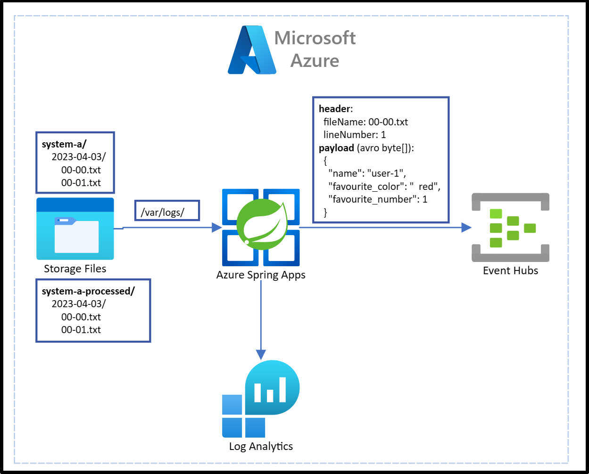
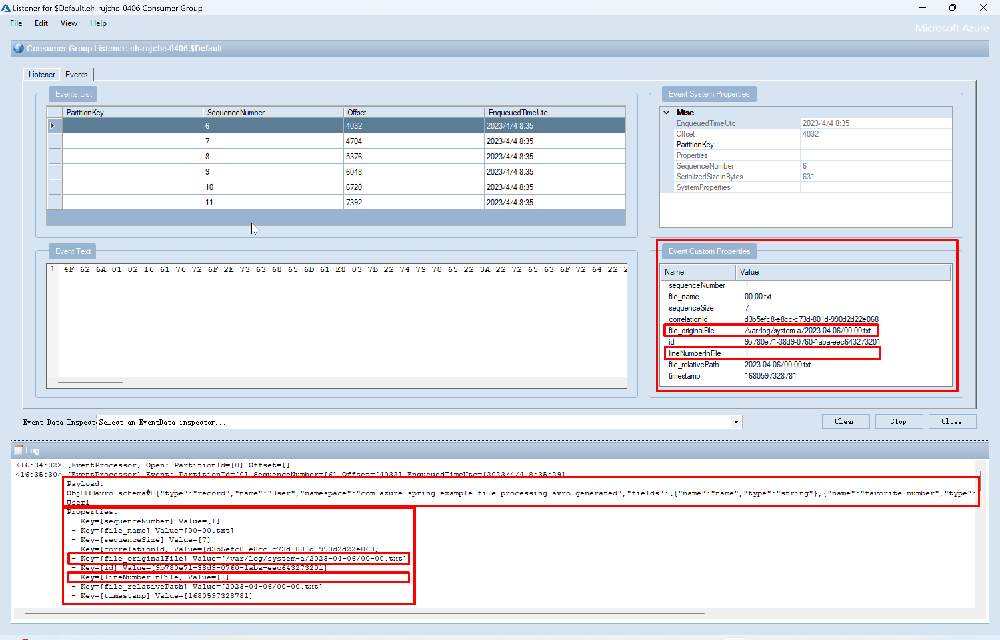

# Azure Spring Apps File Processing Sample

## 1. Scenario

### 1.1. Log Files Explanation

1. A system generates log files in folders named by date: `/var/log/system-a/${yyyy-MM-dd}`. 
2. The Log files are txt files named by hour and minute: `${hh-mm}.txt`.
3. Each line of the log files will have format like this: `name,favorite_number,favorite_color`.

Here is a screenshot about log files and folders:

   

### 1.2. File Processing Requirements

#### 1.2.1. Functional Requirements
1. All log files should be processed.
2. Each line should be processed into an [avro](https://avro.apache.org/docs/1.11.1/) object. Here is the format of avro:
   ```json
   {
     "namespace": "com.azure.spring.example.file.processing.avro.generated",
     "type": "record",
     "name": "User",
     "fields": [
       {
         "name": "name",
         "type": "string"
       },
       {
         "name": "favorite_number",
         "type": [
           "int",
           "null"
         ]
       },
       {
         "name": "favorite_color",
         "type": [
           "string",
           "null"
         ]
       }
     ]
   }
   ```
3. Send the avro object to [Azure Event Hubs](https://learn.microsoft.com/en-us/azure/event-hubs/event-hubs-about).
4. After file processed, move the file to another folder `/var/log/system-a-processed/${yyyy-MM-dd}`

#### 1.2.2. Functional Requirements
1. The system must be robust. 
   - 1.1. Handle dirty data. When there is an dirty data in a file, output a warning log then continue processing.
   - 1.2. Retry when there is issue like network. For example: Azure Event Hub can not been accessed.
2. Easy to track.
   - 2.1. When there is dirty data, the log should contain these information:
      - Which file?
      - Which line?
   - 2.2. Track each step of file processing?
      - Does this file be added in to processing candidate?
      - This file is filtered out, why?
      - How many line does this line have?


### 1.3. System Diagram

   

1. **Azure Spring Apps**: Current application will run on Azure Spring Apps.
2. **Azure Storage Files**: Log files stored in Azure Storage files.
3. **Azure Event Hubs**: In log files, each valid line will be converted into avro format then send to Azure Event Hubs. 
4. **Log Analytics**: When current application run in Azure Spring Apps, the logs can be viewed by Log Analytics.

## 2. Run Current Sample on Azure Spring Apps Consumption Plan

### 2.1. Provision Required Azure Resources

1. Provision an Azure Spring Apps Standard consumption plan. Refs: [Provision an Azure Spring Apps Standard consumption plan service instance](https://learn.microsoft.com/en-us/azure/spring-apps/quickstart-provision-standard-consumption-service-instance?tabs=Azure-portal).
2. Create An app in created Azure Spring Apps.
3. Create an Azure Event Hub. Refs: [Create an event hub using Azure portal](https://learn.microsoft.com/en-us/azure/event-hubs/event-hubs-create).
4. Create Azure Storage Account. Refs: [Create a storage account](https://learn.microsoft.com/en-us/azure/storage/common/storage-account-create?tabs=azure-portal).
5. Create a File Share in created Storage account.
6. Mount Azure Storage into Azure Spring Apps to `/var/log/`. Refs: [How to enable your own persistent storage in Azure Spring Apps with the Standard consumption plan](https://learn.microsoft.com/en-us/azure/spring-apps/how-to-custom-persistent-storage-with-standard-consumption#add-storage-to-an-app).

### 2.2. Deploy Current Sample
1. Set these environment variables for the app.
   ```properties
   logs-directory=/var/log/system-a
   processed-logs-directory=/var/log/system-a-processed
   spring.cloud.azure.eventhubs.connection-string=
   spring.cloud.azure.eventhubs.event-hub-name=
   ```
2. Upload some sample log files into Azure Storage Files.
3. Set necessary environment variables according to the created resources.
   ```shell
   RESOURCE_GROUP=
   LOCATION=
   AZURE_CONTAINER_APPS_ENVIRONMENT=
   AZURE_SPRING_APPS_INSTANCE=
   APP_NAME=
   STORAGE_ACCOUNT_NAME=
   FILE_SHARE_NAME=
   STORAGE_MOUNT_NAME=
   ```
4. Build package.
   ```shell
   ./mvnw clean package
   ```
5. Deploy app
   ```shell
   az spring app deploy \
     --resource-group $RESOURCE_GROUP \
     --service $AZURE_SPRING_APPS_INSTANCE \
     --name $APP_NAME \
     --artifact-path target/azure-spring-apps-file-processing-sample-0.0.1-SNAPSHOT.jar
   ```
6. Check log by [Azure CLI](https://learn.microsoft.com/en-us/cli/azure/)
   ```shell
   az spring app logs \
     --resource-group $RESOURCE_GROUP \
     --service $AZURE_SPRING_APPS_INSTANCE \
     --name $APP_NAME
   ```
7. Check logs by [Azure Portal](https://ms.portal.azure.com/) -> Monitoring -> Logs
 
   Query:
   ```
   AppEnvSpringAppConsoleLogs_CL
   | where TimeGenerated > now(-7m)
   | project time_t, Log_s
   | order by time_t asc
   ```

   Screenshot:
   

### 2.3. Check the execution result

1. When a line of text is invalid, output a warning log, then continue handling remaining lines.

   Query:
   ```
   AppEnvSpringAppConsoleLogs_CL
   | where TimeGenerated > now(-40m)
   | project time_t, Log_s
   | where Log_s has "Convert txt string to User failed"
   | order by time_t asc
   ```

   Screenshot:
   

2. Get all logs about a specific file.

   Query:
   ```
   AppEnvSpringAppConsoleLogs_CL
   | where TimeGenerated > now(-40m)
   | project time_t, Log_s
   | where Log_s has "/var/azure-spring-apps-file-processing-sample/input/file-1.txt"
   | order by time_t asc
   ```

   Screenshot:
   

3. Check events in Azure Event Hubs.
   
   Events in Azure Event Hubs can be viewed by [ServiceBusExplorer](https://github.com/paolosalvatori/ServiceBusExplorer). (I'm using version 5.0.4.)

   Screenshot:
   

## 3. Next Steps

### 3.1. Store secret in Azure Key Vault

Secret can be stored in [Azure Key Vault secrets](https://learn.microsoft.com/en-us/azure/key-vault/secrets/about-secrets) and used in this application. [spring-cloud-azure-starter-keyvault](https://learn.microsoft.com/en-us/azure/developer/java/spring-framework/configure-spring-boot-starter-java-app-with-azure-key-vault) is a useful tool to get secrets from Azure KeyVault in Spring Boot applications. And `spring-cloud-azure-starter-keyvault` supports refresh the secrets in a fixed interval.

The following values can be treated as secrets in current file-processing application:
1. Connection string to Azure Event Hubs.
2. Passwords of a specific file. All file-secret can be stored a key-value map. And the key-value map can be serialized and stored in Azure Key Vault Secrets. 

### 3.2. Auto Scaling.

### 3.2.1. Scale 0 - 1

#### 3.2.1.1. Requirement

1. Scale to 0 instance when:
   - There is no file need to be handled for more than 1 hour. 
2. Scale to 1 instance when one of these requirements satisfied:
   - File exists for more than 1 hour.
   - File count > 100.
   - File total size > 1 GB.

#### 3.2.1.2. Current Problem
1. Now KEDA does not support scaling by Azure Storage File Share. Refs: [Currently available scalers for KEDA](https://keda.sh/docs/2.9/scalers/)

### 3.2.2. Scale 1 - n

#### 3.2.2.1. Requirement

1. Scale instances by the workload. Here are some example strategy:
    - Scale instance number to Math.max(fileCount / 10000. fileSize / 10000).

#### 3.2.2.2. Current Problem
1. Now KEDA does not support scaling by Azure Storage File Share. Refs: [Currently available scalers for KEDA](https://keda.sh/docs/2.9/scalers/).
2. In current implementation, when the instance count > 1, files are possible to be processed more than one time. Maybe [Master/slave module](https://en.wikipedia.org/wiki/Master/slave_(technology)) can be used. Need more investigation to implement this module in ASA.

